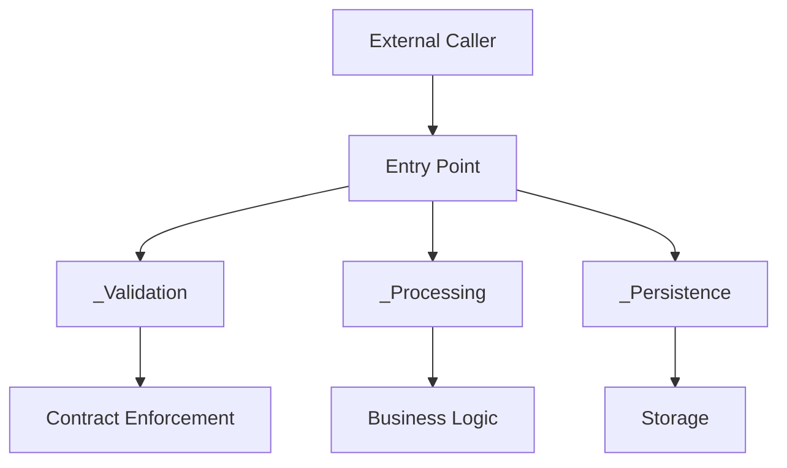

# Intense Cup Studios

# Coding Standards – Lights Out

**Project:** Lights Out
**Company:** Intense Cup Studios
**Language:** C# (Unity)
**Last Updated:** June 2026

---

# Philosophy

The purpose of coding standards is not to make code look pretty.

The purpose is to make code:

* Easier to understand
* Easier to modify
* Easier to review
* Harder to break

A codebase should optimize for the developer who must maintain it six months from now, not the developer writing it today.

When in doubt, favor:

> Clarity over cleverness.

---

# Development Workflow

## When Picking Up a Task

Before writing code:

### 1. Write Down the Requirements

Every task should begin by answering:

* What problem am I solving?
* What behavior should change?
* What behavior should remain unchanged?
* How will I know when I am done?

Example:

```text
Feature:
Player can restart the current level.

Requirements:
- Restart button appears on pause menu.
- Restart resets puzzle state.
- Restart does not reset player settings.
- Restart loads in under 1 second.
```

---

### 2. Draft a High-Level Solution

Before implementation, create a rough design.

Do not immediately jump into coding.

A napkin sketch is sufficient.

Example:

```text
RestartButton
    ↓
GameManager.restartLevel()
    ↓
LevelManager.reloadCurrentLevel()
    ↓
PuzzleState.reset()
```

The goal is to identify:

* Responsibilities
* Dependencies
* Risks
* Assumptions

before code exists.

---

## After Implementation

### 3. Document the Solution

Documentation should scale with complexity.

| Change Size | Documentation               |
| ----------- | --------------------------- |
| Tiny        | None                        |
| Small       | PR Description              |
| Medium      | PR Description + Notes      |
| Large       | Dedicated Markdown Document |

Examples:

**No Documentation Needed**

```text
Changed button color.
Fixed typo.
Updated sound volume.
```

**Requires Documentation**

```text
Implemented save system.
Added inventory architecture.
Created AI behavior framework.
```

---

### 4. Create Dev Tests

Dev tests are manual tests performed by developers.

These are not QA tests.

Example:

```text
Test 1:
Open game
Press Restart
Verify puzzle resets

Test 2:
Open game
Change settings
Restart level
Verify settings remain unchanged
```

Every feature should have a clear way to manually verify success.

---

### 5. Create Automated Tests (When Possible)

If a system can be tested automatically, it should be.

Potential Unity testing approaches:

* NUnit
* Unity Test Framework
* Play Mode Tests
* Edit Mode Tests

Example:

```csharp
[Test]
public void restartLevel_resetsPuzzleState()
{
    puzzleState.completePuzzle();

    gameManager.restartLevel();

    Assert.IsFalse(puzzleState.isCompleted);
}
```

> [!NOTE]
> the above section still has to be researched and decided on as a team if it's needed

---

### 6. Open a Pull Request

**Every change should receive review.**

Even simple changes benefit from another set of eyes.

A PR should include:

* Problem statement
* Solution summary
* Dev tests
* Screenshots (if applicable)

---

# Core Design Principles

---

## 1. One Responsibility Per File

Each file should have a single purpose.

### Good

```text
AudioManager
PlayerController
SaveSystem
LevelLoader
```

### Bad

```text
GameManager
```

if it handles:

* Audio
* Saving
* UI
* Input
* Analytics
* Level loading

then it is actually six systems hiding inside one file.

---

## 2. Prefer Top-Down Design

A reader should understand what happens before understanding how it happens.

### Good

```csharp
public void startLevel()
{
    _validateLevel();

    _loadLevelData();

    _initializeObjects();

    _beginGameplay();
}
```

Helper methods describe intent.

---

### Bad

```csharp
public void startLevel()
{
    // 200 lines of implementation
}
```

The reader must understand every line before understanding the goal.

---

## 3. Every File Has Entry Points

Entry points are methods intended to be called externally or serve the main focus of the present file. Think `SaveGame`, `Update` or `OnInput`. 

Example:

```csharp
public class SaveSystem{
    public void saveGame(){
        _validateSaveData();
        _serializeData();
        _writeFile();
    }
}
```

---

## 4. Internal Logic Uses Helper Methods

Helper methods should begin with `_`.

Example:

```csharp
public void saveGame()
{
    _validateSaveData();
    _serializeData();
    _writeFile();
}

private void _validateSaveData()
{
}

private void _serializeData()
{
}

private void _writeFile()
{
}
```

---

## 5. Keep Methods Small

As a general rule:

> Methods should never be more then roughly 50 lines of code

Not because 51 lines is evil.

Because large methods usually indicate:

* Multiple responsibilities
* Poor naming
* Hidden complexity

---

## 6. Self-Documenting Code

Good names eliminate comments.

### Good

```csharp
bool hasRemainingMoves;
float puzzleCompletionPercent;

calculatePlayerScore();
resetCurrentPuzzle();
```

### Bad

```csharp
bool x;
float val;

calc();
doThing();
```

---

## 7. No Magic Numbers

Avoid unexplained values.

### Bad

```csharp
if (lives == 3){
}
```

Why 3?

---

### Good

```csharp
private const int MAX_LIVES = 3;

if (lives == MAX_LIVES){
}
```

---

### Better

```csharp
public enum Difficulty{
    Easy,
    Medium,
    Hard
}
```

---

## 8. Use Data Structures Instead of Dictionaries

Avoid anonymous data whenever structure is known.

### Bad (Python)

```python
player = {
    "health": 100,
    "score": 250
}
```

---

### Better (Python)

```python
class PlayerData(BaseModel):
    health: int
    score: int
```

---

### Good (C#)

```csharp
public class PlayerData{
    public int health;
    public int score;
}
```

---

### Better (C#)

```csharp
public class PlayerData
{
    public int health { get; private set; }

    public int score { get; private set; }

    public PlayerData(int health, int score){
        this.health = health;
        this.score = score;
    }
}
```

Benefits:

* Compile-time validation
* IDE support
* Refactoring safety
* Reduced bugs

---

## 9. Naming Conventions

We intentionally deviate from standard C# convention. Call me Java pilled but me think its ugly. 

### Classes

```csharp
public class PlayerController
{
}
```

### Interfaces

```csharp
public interface IDamageable
{
}
```

### Enums

```csharp
public enum PuzzleState
{
}
```

### Methods

```csharp
calculateScore()
```

### Variables

```csharp
playerHealth
```

### Constants

```csharp
MAX_HEALTH

DEFAULT_RESPAWN_TIME
```

---

## 10. Always Use Named Parameters

### Bad

```csharp
spawnEnemy("Zombie", 5, true);
```

Nobody knows what those values mean.

---

### Good

```csharp
spawnEnemy(
    enemyType: "Zombie",
    spawnCount: 5,
    isAggressive: true
);
```

The call site becomes self-documenting.

---

# Contract-Driven Development

One of the most common causes of bugs is hidden agreements between developers.

These agreements are called:

> Promises

Promises eventually get broken.

Instead, create contracts.

---

## Promise Example

Imagine a JSON payload.

```json
{
  "playerName": "Alex",
  "level": 5
}
```

Every developer is now promising:

* Property names stay identical
* Types stay identical
* Documentation remains updated

These promises are fragile.

---

## Contract Example

```csharp
public class SaveData
{
    public string playerName;

    public int level;
}
```

Now the compiler enforces the structure.

The promise became a contract.

---

## Environment Variable Example

### Bad

```python
os.getenv("API_KEY")
```

Every file may interpret defaults differently.

---

### Better

```csharp
public static class EnvironmentConfig
{
    public static readonly string apiKey;

    static EnvironmentConfig()
    {
        apiKey = loadRequired("API_KEY");
    }
}
```

Benefits:

* Single source of truth
* Validation occurs once
* Self-documenting
* Consistent defaults

---

# Example Architecture

A typical feature should resemble:



---

# Failure Handling

Before submitting code, ask:

## 1. Does My Code Fail Gracefully?

Bad:

```csharp
throw new Exception();
```

Good:

```csharp
if (saveData == null)
{
    Debug.LogError(
        "Save data was null."
    );

    return;
}
```

Players should never experience crashes because of predictable failures.

---

## 2. What Assumptions Am I Making?

Every system makes assumptions.

Examples:

```text
A save file exists.
A scene is loaded.
A prefab is assigned.
A network connection exists.
```

Ask:

```text
What happens if this assumption is wrong? Is this a reasonable assumption? 
```

---

## 3. How Easy Is This To Modify?

Imagine future requirements:

```text
Add multiplayer.
Add cloud saves.
Add custom puzzle modes.
```

Would your design survive?

Or would it require a rewrite?

Favor extension over replacement.

---

## 4. Have I Turned Promises Into Contracts?

Look for:

* JSON
* Dictionaries
* Environment variables
* Config files
* Save files
* Network payloads

If developers must "remember" something, create a contract.

---

# Unity-Specific Guidelines

---

## Avoid Find()

### Bad

```csharp
GameObject.Find("Player");
```

---

### Better

```csharp
[SerializeField]
private PlayerController playerController;
```

---

## Avoid Singleton Abuse

Not every manager needs to be global.

Bad:

```text
AudioManager
UIManager
QuestManager
InventoryManager
SettingsManager
AnalyticsManager
AchievementManager
```

all implemented as singletons.

## Prefer Scriptable Objects For Configuration

Instead of:

```csharp
private const float PLAYER_SPEED = 5f;
```

consider:

```csharp
PlayerConfig
```

stored as a ScriptableObject.

Designers can modify values without code changes.

---

# AI Usage Guidelines

AI is simultaneously one of the best and worst tools available.

Use it intelligently.

---

## AI Is Good At

* Brainstorming
* Documentation
* Reviewing code
* Finding edge cases
* Generating test ideas
* High-level architecture

---

## AI Is Bad At

* Understanding project context
* Maintaining consistency
* Making design decisions
* Long-term maintainability

---

## Common AI Failure Modes

### 1. Rewriting Existing Code

AI frequently replaces working code unnecessarily.

---

### 2. Removing Edge Cases

AI often "fixes" bugs by removing complexity rather than understanding it.

---

### 3. Regex Abuse

AI loves solving everything with:

```regex
.*(.+)?[\w]
```

If you cannot explain the regex, do not ship it.

---

### 4. Syntax Over Readability

AI often prefers:

```csharp
var result = values
    .Where(x => x.isEnabled)
    .GroupBy(x => x.type)
    .SelectMany(x => x)
    .OrderBy(x => x.priority)
    .ToList();
```

over straightforward logic.

Readable code wins.

---

# Recommended AI Workflow

### Step 1

Describe the problem.

---

### Step 2

Ask AI for potential approaches.

---

### Step 3

Challenge every assumption.

Example:

```text
What edge cases exist?

What assumptions are being made?

What are the risks?

What would break this solution?
```

---

### Step 4

Implement the solution yourself.

---

### Step 5

Use AI as a reviewer.

---

# Personal Rule

> Copy-pasting code is the death of understanding.

Use AI to improve your thinking.

Do not use AI to replace it.

---

# Tool Recommendations

### OpenAI

Best for:

* Documentation
* Prompt optimization
* Simple UI work

---

### Gemini

Best for:

* System design
* Code review
* General coding tasks

---

### Claude

Best for:

* Complex engineering problems
* Refactoring
* Architecture discussions

---

### DeepSeek

Best for:

* Small to medium coding tasks
* Quick experimentation

---

# Final Checklist

Before opening a PR:

* [ ] Requirements documented
* [ ] High-level design created
* [ ] Solution documented
* [ ] Dev tests written
* [ ] Automated tests added (if possible)
* [ ] No magic numbers
* [ ] Uses contracts where appropriate
* [ ] Handles failures gracefully
* [ ] Methods remain focused
* [ ] File has a single responsibility
* [ ] Assumptions identified
* [ ] Future modifications considered
* [ ] PR created
* [ ] Code reviewed

---

> Good code is not code that works.
>
> Good code is code that continues to work after requirements change.
