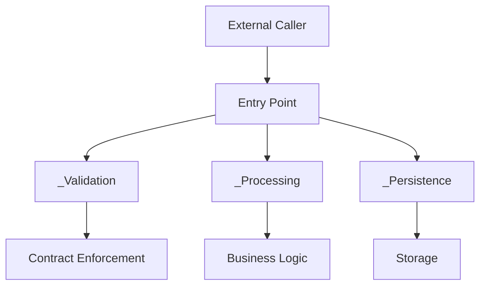

# Intense Cup Studios

# Coding Standards – Lights Out

**Project:** Lights Out
**Company:** Intense Cup Studios
**Language:** C# (Unity)
**Last Updated:** July 2026

---

# Philosophy

The purpose of coding standards is not to make code look pretty.

The purpose is to make code:

* Easier to understand
* Easier to modify
* Easier to review
* Harder to break

A codebase should optimize for the developer who must maintain it six months from now, not the developer writing it today.

When in doubt, favor:

> Clarity over cleverness.

## TLDR

### Coding Guidelines

* Each file should have one responsibility
* No magic numbers (should always be a constant, enum + dict, or a static constant class)
* Names should always be descriptive
* Always specify parameter names when passing in arguments
* Always specify type (return, variable, etc...).
* Methods should be no more then 50 lines
* When methods become too long, break them down into helper methods using top down design
    * methods should read easy
    * From a math perspective, this is like breaking a function down into a composition of functions
    * From a software perspective, this is like decomposing a method into it's modular components and putting them back together
* Helper methods should either be private or start with an '_' depending on the language
* Ensure all promises are turned into contracts using enforcers.
* Never use schemeless objects such as maps or json objects. When able, prefer classes, dataclasses, or schema enforcing objects.
* Code should be dynamically documented. Self documenting code, one line, full doc-string, markdown file. 
* A function/method should aim for only one return statement
* Aim for zero nesting but if needed, no more then 2 (if, switch, looping, etc...)
* If a function/method returns multiple elements, it should return a dataclass. No tuples, lists, maps/dicts, etc...

### Design Pattern choices

When deciding on design patterns, ask the following questions:

1. Is the design self-documenting and easy to understand?

2. How easily does this scale in terms of features and merge conflicts?

3. Does this reduce the mental model of developer (when code is changed, how many things does the developer need to remember)

4. Are all promises turned into contracts?

---

# Development Workflow

## When Picking Up a Task

Before writing code:

### 1. Write Down the Requirements

Every task should begin by answering:

* What problem am I solving?
* What behavior should change?
* What behavior should remain unchanged?
* How will I know when I am done?

---

### 2. Draft a High-Level Solution

Before implementation, create a rough design.

Do not immediately jump into coding.

A napkin sketch is sufficient.

Example:

```text
RestartButton
    ↓
GameManager.restartLevel()
    ↓
LevelManager.reloadCurrentLevel()
    ↓
PuzzleState.reset()
```

The goal is to identify:

* Responsibilities
* Dependencies
* Risks
* Assumptions

before code exists.

### 3. Branch It

Make sure to create a seperate branch in which you can implement your solution. I.e **never code on main out right**.


---

## After Implementation

### 4. Document the Solution

Documentation should scale with complexity.

| Change Size | Documentation               |
| ----------- | --------------------------- |
| Tiny        | None                        |
| Small-Medium| PR Description              |
| Large       | Dedicated Markdown Document |

Examples:

**No Documentation Needed**

```text
Changed button color.
Fixed typo.
Updated sound volume.
```

**Requires Documentation**

```text
Implemented save system.
Added inventory architecture.
Created AI behavior framework.
```

---

### 5. Create Dev Tests

Dev tests are manual tests performed by developers.

These are not QA tests.

Example:

```text
Test 1:
Open game
Press Restart
Verify puzzle resets

Test 2:
Open game
Change settings
Restart level
Verify settings remain unchanged
```

Every feature should have a clear way to manually verify success.

---

### 6. Create Automated Tests (When Possible)

If a system can be tested automatically, it should be.

Potential Unity testing approaches:

* NUnit
* Unity Test Framework
* Play Mode Tests
* Edit Mode Tests

Example:

```csharp
[Test]
public void restartLevel_resetsPuzzleState(){
    puzzleState.completePuzzle();

    gameManager.restartLevel();

    Assert.IsFalse(puzzleState.isCompleted);
}
```

> [!NOTE]
> the above section still has to be researched and decided on as a team if it's needed

---

### 7. Open a Pull Request

**Every change should receive review.**

Even simple changes benefit from another set of eyes.

A PR should include:

* Problem statement
* Solution summary
* Dev tests
* Screenshots (if applicable)

> [!NOTE]
> Commits should be small and well documented. PRs when able, should also be reasonably small. 

> [!WARNING]
> Never commit on main, always create a new branch and merge into main via a PR


# Core Design Principles

---

## One Responsibility Per File

Each file should have a single purpose.

### Good

```text
AudioManager
PlayerController
SaveSystem
LevelLoader
```

### Bad

```text
GameManager
```

if it handles:

* Audio
* Saving
* UI
* Input
* Analytics
* Level loading

then it is actually six systems hiding inside one file.

---

## Prefer Top-Down Design

A reader should understand what happens before understanding how it happens.

### Good

```csharp
public void startLevel(){
    _validateLevel();

    _loadLevelData();

    _initializeObjects();

    _beginGameplay();
}
```

Helper methods describe intent.

---

### Bad

```csharp
public void startLevel(){
    // 200 lines of implementation
}
```

The reader must understand every line before understanding the goal.

---

## Internal Logic Uses Helper Methods

Helper methods should begin with `_` and or be private methods.

Example:

```csharp
public void saveGame(){
    _validateSaveData();
    _serializeData();
    _writeFile();
}

private void _validateSaveData(){
}

private void _serializeData(){
}

private void _writeFile(){
}
```

---

## Keep Methods Small

As a general rule:

> Methods should never be more then roughly 50 lines of code

Not because 51 lines is evil.

Because large methods usually indicate:

* Multiple responsibilities
* Poor naming
* Hidden complexity

---

## Self-Documenting Code

Good names eliminate comments.

### Good

```csharp
bool hasRemainingMoves;
float puzzleCompletionPercent;

calculatePlayerScore();
resetCurrentPuzzle();
```

### Bad

```csharp
bool x;
float val;

calc();
doThing();
```

---

## No Magic Numbers

Avoid unexplained values.

### Bad

```csharp
if (lives == 3){
}
```

Why 3?

---

### Good

```csharp
private const int MAX_LIVES = 3;

if (lives == MAX_LIVES){
}
```

---

### Better

```csharp
public enum Difficulty{
    Easy,
    Medium,
    Hard
}
```

---

## Use Data Structures Instead of Dictionaries

Avoid anonymous data whenever structure is known.

### Bad (Python)

```python
player = {
    "health": 100,
    "score": 250
}
```

---

### Better (Python)

```python
class PlayerData(BaseModel):
    health: int
    score: int
```

---

### Good (C#)

```csharp
public class PlayerData{
    public int health;
    public int score;
}
```

---

### Better (C#)

```csharp
public class PlayerData{
    public int health { get; private set; }

    public int score { get; private set; }

    public PlayerData(int health, int score){
        this.health = health;
        this.score = score;
    }
}
```

Benefits:

* Compile-time validation
* IDE support
* Refactoring safety
* Reduced bugs

---

## Naming Conventions

We intentionally deviate from standard C# convention. Call me Java pilled but me thinks standard C# ugly. 

### Classes

```csharp
public class PlayerController{
    // starts with capital and uses capital to separate
    // note that abstract classes are the same way
}
```

### Interfaces

```csharp
public interface IDamageable{
    // same as classes
}
```

### Enums

```csharp
public enum PuzzleState{
    // same as classes
}
```

### Methods

```csharp
calculateScore() // start with lowercase
```

### Variables

```csharp
playerHealth // start with lowercase
```

### Constants

```csharp
MAX_HEALTH

DEFAULT_RESPAWN_TIME // all upper and separated with _
```


## Always Use Named Parameters

### Bad

```csharp
spawnEnemy("Zombie", 5, true);
```

Nobody knows what those values mean.

---

### Good

```csharp
spawnEnemy(
    enemyType: "Zombie",
    spawnCount: 5,
    isAggressive: true
);
```

The call site becomes self-documenting.

## Brackets should be K&R style

This is a personal thing, and honest to god, you can do either for this one, by I hate the way C# does curly braces {}

```csharp
// instead of this
int someMethod()
{
    // code here    
}

// I personally do this (call me java pilled)
int someMethod2(){

}
```

---

# Contract-Driven Development

One of the most common causes of bugs is hidden agreements between developers.

These agreements are called:

> Promises

Promises eventually get broken.

Instead, create contracts.

---

## Promise Example

Imagine a JSON payload.

```json
{
  "playerName": "Alex",
  "level": 5
}
```

Every developer is now promising:

* Property names stay identical
* Types stay identical
* Documentation remains updated

These promises are fragile.

---

## Contract Example

```csharp
public class SaveData{
    public string playerName;

    public int level;
}
```

Now the compiler enforces the structure.

The promise became a contract.

---

## Environment Variable Example

### Bad

```python
os.getenv("API_KEY")
```

Every file may interpret defaults differently, forget these exists, and unless documentation is updated and read regularly the developer does not know this api key is needed. 


### Better

```csharp
public static class EnvironmentConfig{
    public static readonly string apiKey;

    static EnvironmentConfig(){
        apiKey = loadRequired("API_KEY");
    }
}
```

Benefits:

* Single source of truth
* Validation occurs once
* Self-documenting
* Consistent defaults

#### Another example
If you are looking for another example of this contract methodology, view this external Issue request I made for a separate project here [Filter Example](FilterExample.markdown)

---

# Example Architecture

A typical feature should resemble:


```mermaid
flowchart TD

A[External Caller]
--> B[Entry Point]

B --> C[_Validation]
B --> D[_Processing]
B --> E[_Persistence]

C --> F[Contract Enforcement]

D --> G[Business Logic]

E --> H[Storage]
```

# Unity-Specific Guidelines

---

## Avoid Find()

### Bad

```csharp
GameObject.Find("Player");
```


### Better

```csharp
[SerializeField]
private PlayerController playerController;
```

---

## Avoid Singleton Abuse

Not every manager needs to be global.

Bad:

```text
AudioManager
UIManager
QuestManager
InventoryManager
SettingsManager
AnalyticsManager
AchievementManager
```

all implemented as singletons.

## Prefer Scriptable Objects For Configuration

Instead of:

```csharp
private const float PLAYER_SPEED = 5f;
```

consider:

```csharp
PlayerConfig
```

stored as a ScriptableObject.

Designers can modify values without code changes.

---

# AI Usage Guidelines

AI is simultaneously one of the best and worst tools available.

Use it intelligently.

---

## AI Is Good At

* Brainstorming
* Documentation
* Reviewing code
* Finding edge cases
* Generating test ideas
* High-level architecture

---

## AI Is Bad At

* Understanding project context
* Maintaining consistency
* Making design decisions
* Long-term maintainability

---

## Common AI Failure Modes

1. Rewriting Existing Code

AI frequently replaces working code unnecessarily or adds a method that already exists in the codebase. 

2. Removing Edge Cases

AI often "fixes" bugs by removing complexity rather than understanding it.

3. Confusing code

AI loves solving everything with regex such as:

```regex
.*(.+)?[\w]
```

Or likewise, vectorizes a simple array, masking instead of looping. AI writes long boilerplate code that looks like a senior dev to confuse you. If you're not careful, you won't understand the code in due time. 

If you cannot explain the code, do not ship it.

---

### 4. Syntax Over Readability

AI often prefers:

```csharp
var result = values
    .Where(x => x.isEnabled)
    .GroupBy(x => x.type)
    .SelectMany(x => x)
    .OrderBy(x => x.priority)
    .ToList();
```

over straightforward logic.

Readable code wins.

---

# Recommended AI Workflow

1. Describe the problem. For larger issues, it's sometimes best to hand the initial prompt over to chatgpt and ask it to optimize your prompt (make sure to proof read and edit however)

2. Ask AI for potential approaches.

3. Challenge every assumption.

Example:

```text
What edge cases exist?

What assumptions are being made?

What are the risks?

What would break this solution?
```

4. Implement the solution yourself.

5. Use AI as a reviewer.

---

# Personal Rule

> Copy-pasting code is the death of understanding.

Use AI to improve your thinking.

Do not use AI to replace it.

---

# Tool Recommendations

### OpenAI

Best for:

* Documentation
* Prompt optimization
* Simple UI work

---

### Gemini

Best for:

* System design
* Code review
* General coding tasks

---

### Claude (if able)

Best for:

* Complex engineering problems
* Refactoring
* Architecture discussions

---

### DeepSeek

Best for:

* Small to medium coding tasks
* Quick experimentation

---

# Final Checklist

Before opening a PR for review:

* [ ] Requirements documented
* [ ] High-level design created
* [ ] Solution documented
* [ ] Dev tests written
* [ ] Automated tests added (if possible)
* [ ] No magic numbers
* [ ] Uses contracts where appropriate
* [ ] Handles failures gracefully
* [ ] Methods remain focused
* [ ] File has a single responsibility
* [ ] Assumptions identified
* [ ] Future modifications considered

