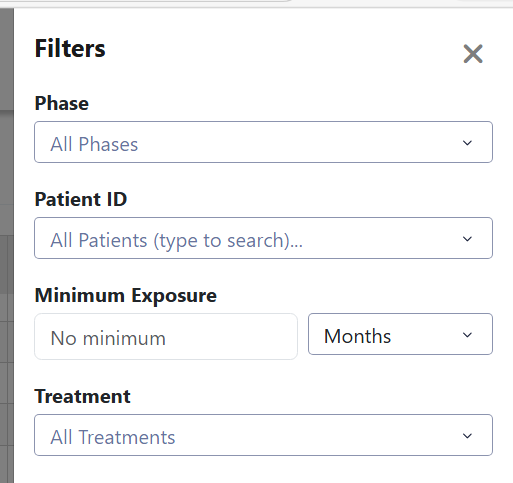

### Overview

Under the current approach the filtering object uses 2 methods as entry points for both *getting filter options* and for *filtering patient IDs*. 

For example, to get filter options we must do the following

```python

options = Filter(study_id).get_filter_options(
    p1 = True,
    p2 = True,
    ...,
    pm = True
)

# post processing layer

return (
    options[FiltrerKey.P1],
    options[FiltrerKey.P2],
    ...
    options[FiltrerKey.Pm]
)

```

Likewise, to perform the filtering itself we may implement the following:

```python
patient_ids = Filter(study_id).get_filtered_patients(
    p1 = c1,
    p2 = c2,
    ...
    pm = cm
)
```

where $p_i$ is the parameter name such as Phase, Treatment, Indication, etc... and $c_i$ is the filter choice associated with $p_i$. By mandating that each dashboard use the filter object, we help centralize the logic for the filtering layer however the current implementation of the filtering class could be improved in regards to 2 issues. 

### Issue 1: Defensive Programming
The current implementation relies on a promise between the programmers in a few ways. 

**Promise 1** says that I will always specify the parameter name $p_i$ in the function call as to make sure that any changes down the line don't cause weird side effects

For example, a dev could write the following code:

```python
patient_ids = Filter(study_id).get_filtered_patients(
    c1,
    None,
    ...
    cm
)
```
If the order of the parameters were to change down the line for any reason, this code produces weird side effects.

**Promise 2:** says that the dev will always use the `FilterKey` enumerator when using the returned options hash map. But the developer can just ignore this and use the string key instead. 

```python

options[FilterKey.PHASE]
# this is logically the same as above and allowed 
# but if the key was to change in the future for any reason the code no longer works. 
options["phase"] 

````

### Issue 2: Prone to merge conflicts

If two developers want to append a new filter parameter $p_{m+1}$ to the method call, we will run into a merge conflict. This is easy to solve in theory, but it does take some time dealing with the conflict and as per *issue 1* if a dev doesn't follow *promise 1* can cause dashboards to not work or behave in weird manners. 

> dev one expects parameters $p_{m+1}$ and $p_{m+2}$ to be in said order but dev two expects them to be in the order $p_{m+2}$, $p_{m+1}$ after the merge

### Proposed Solution

To get around these issues, I propose to imbue stronger encapsulation along with structured data objects as to force developers to adhere to the proposed promises.

To adhere to *Promise 1*, instead of passing a long list of positional arguments or chaining methods, we can introduce a strongly typed `FilterQuery` object (using Python dataclasses). This configuration object acts as a structured schema where order no longer matters, and it natively prevents breaking positional changes. Likewise, python offers **a mechanism to enforce positional arguments having their names specified** using the * symbol. 

```python
class Filter:
    def get_filtered_patients(self, *, phase=None, treatment=None, indication=None):
        # The '*' forces every argument after it to be explicitly named
        pass
```

Now when 2 devs, are performing a merge and overwrite the position of previous parameter locations, all code down stream won't be affected as it was forced to use the parameter name allowing python to properly map the method call. 

To address/enforce *Promise 2*, we create a new class called `FilterOptions` which is returned by the filtering engine instead of a raw hash map. Both the underlying filter logic and the `FilterOptions` object will safely use `FilterKey` internally, but the developer using the class no longer needs to be aware of or interact with `FilterKey`. IDE auto-complete will handle the rest.

```python
from dataclasses import dataclass, field
from typing import List, Optional

@dataclass
class FilterQuery:
    # Adding a new filter just means adding one line here. 
    # Order doesn't matter, and defaults prevent breaking changes.
    phase: Optional[List[str]] = None
    treatment: Optional[List[str]] = None
    indication: Optional[List[str]] = None

@dataclass
class FilterOptions:
    # A structured response object so devs don't use raw dicts/strings
    phase_options: List[str] = field(default_factory=list)
    treatment_options: List[str] = field(default_factory=list)
```
> [!NOTE]
>  Why * for getting options but not filtering? My thinking is that requesting available options is a simple, flat checklist of boolean toggles (phase=True, treatment=True). Using keyword-only arguments (*) solves the positional argument risk with zero boilerplate overhead. Introducing a separate class just for this adds overhead and more boilerplate code for minimal reward. 
> The active filtering payload grows in complexity over time (passing arrays of strings, date ranges, etc.). Moving this payload into a dedicated FilterQuery class prevents the get_filtered_patients method signature from ballooning into a long parameter list and keeps git merge conflicts isolated to a single data schema.

By implementing these two structures, the core cycle behind using the filter object would be the following (to make the example more clear, assume we only want to filter by treatment and phase):

```python
# 1. Getting options (passing True/False flags as keyword-only arguments)
options: FilterOptions = Filter(study_id).get_filter_options(phase=True, treatment=True)

# Post processing layer (No strings, no dictionary keys, auto-complete works!)
return (
    options.treatment_options,
    options.phase_options
)
````

```python
# 2. Executing the filter
query = FilterQuery(
    treatment=[...],
    phase=[...]
)

patient_ids = Filter(study_id).get_filtered_patients(query)

````

Second Point: It might make more sense to call this class `SubjectFilter` instead since this is in charge of filtering subject IDs and not row data itself. 

While working on adverse events, I ran into the issue in which non-related data points were showing up even with the related filter on. The issue was that the filter only removed subjects with no related terms. Subjects with related events passed through the gate no worry along with their non related data rows. To make this distinction more clear and to help remember, `SubjectFilter` might be a better name for this class. 

Likewise, other classes would be renamed as well `SubjectFilterQuery`, `SubjectFilterOptions`, etc...

Might make sense to relabel the "Filters" as "Subject Filters" to make this somewhat clear to the user (although this might only help slightly)

