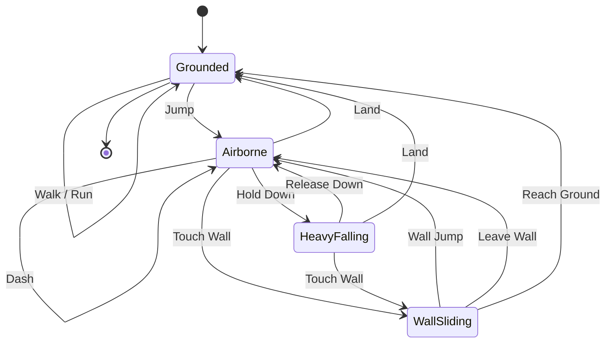

# Player Movement Outline

## Abstract

This document outlines the proposed player movement system for the game. The goal is to create controls that feel **responsive**, **predictable**, and **easy to expand** while keeping the implementation modular and maintainable.

Each movement mechanic should have a clearly defined responsibility, making it easier to tune gameplay without affecting unrelated systems.

---

# General Movement

## Core Principles

* Player input should feel responsive with minimal perceived latency.
* Horizontal movement should be deterministic and immediately reflect player input.
* Special movement abilities (jumping, dashing, wall jumping, etc.) should have clearly defined reset conditions.
* Mechanics should be independent whenever possible to simplify balancing and debugging.
* State transitions should be explicit rather than relying on scattered boolean flags.


## Movement Reference

### Instant Movement (`Rigidbody.velocity`)

> Directly overrides the player's horizontal velocity, allowing immediate acceleration and deceleration.

Used for:

* Left movement
* Right movement
* Direction changes

This approach provides tight platforming controls without the "slippery" feeling. 

### Force-Based Movement (`Rigidbody.AddForce`)

> Applies acceleration or an instantaneous impulse while allowing Unity's physics system to handle the resulting motion.

Used for:

* Jump
* Double Jump
* Dash
* Knockback (future)
* External forces (future)

### Jump

The initial jump should use an impulse force. The player should only be able to jump when actively grounded.

#### Reset Conditions

The jump state resets only after the player has landed.

#### Ground Detection

Proposal:

* Use one or more downward raycasts beneath the player.
* Consider the player grounded only when the raycast hits a valid ground layer.

> [!WARNING]
> Logic should explicitly ignore triggers and only actual body collisions. Likewise, the reset needs to be have a slight time delay as to account for ray cast distance. Should be a function of the raycast distance. 

### Double Jump

The player receives one additional jump while airborne. 

#### Rules

* May only be used once before landing.
* Resets immediately upon touching the ground.
* Should remain available after walking off a ledge. I.e if the player falls off a ledge they can use their double jump but can't use their normal jump while airborne.

A visual indicator should communicate whether the ability is currently available.

### Dash

The dash should apply a short impulse in the player's current movement direction.

#### Rules

* One dash per airborne sequence.
* Dash resets upon touching the ground.
* Must be moving in one direction to activate. 

> [!WARNING]
> This might be somewhat tricky. If not applied correctly. Can very easily cause movement to not feel fluid and can cause a sticky feeling. 

### Falling

While holding the **Down** input, the player enters a heavy fall state.

#### Behavior

* Increase gravity (preferred) or effective mass while airborne.
* Transition into and out of heavy fall instantly.
* Only active while the player is not grounded.
* Releasing the input immediately restores normal gravity.

Using gravity scaling is generally preferable to changing Rigidbody mass, as mass also affects external forces and collisions.

### Wall Sliding

When the player presses against a wall while falling:

* Vertical descent is slowed.
* The player enters the wall sliding state.
* Jump input transitions into a wall jump.


### Wall Jump

Wall jumping should propel the player away from the contacted wall using both horizontal and vertical force.

#### Exploit Prevention

> [!WARNING]
> Wall jumping can easily become infinitely repeatable if not restricted. Below are some methods that might help prevent this that should be implemented.

Proposal:

A wall jump may only be performed again after one of the following occurs:

* The player lands on the ground.
* The player jumps from a different wall.

Implementation ideas:

* Cache the last wall collider.
* Compare collider references or Unity Instance IDs.
* Reject repeated jumps from the same wall until another valid reset occurs.

---

# Visual Indicators

Visual feedback should clearly communicate movement state and ability availability.

## Dash

* Maintain the existing dash streak effect.
* Display a UI icon indicating dash availability.

  * White = Ready
  * Gray = Consumed

## Double Jump

Display a similar indicator showing whether the extra jump is available.

This can initially be implemented as a simple debugging UI.


## Landing

Landing should produce:

* Dust particle effect
* Small landing animation

This reinforces that movement abilities have been refreshed.

## Heavy Fall

While heavy falling:

* Larger impact particles upon landing.
* Downward streak particle effect.

---

# Animation States

Possible animation might include:

* Idle
* Walk
* Jump
* Rising
* Falling
* Heavy Falling
* Wall Slide
* Wall Jump
* Dash
* Landing


## Finite State Machine

Rather than treating every mechanic as its own long-lived state, the movement system should distinguish between **persistent movement states** (such as being grounded or airborne) and **instantaneous movement actions** (such as jumping or dashing).

The player is always in one primary movement state, while actions temporarily modify velocity before returning control back to that state.



### Notes

- **Grounded** is the only state where the normal jump is available.
- **Airborne** represents all standard movement after leaving the ground.
- **Heavy Falling** is simply a modified airborne state with increased gravity.
- **Wall Sliding** is entered only while falling against a valid wall.
- **Jump**, **Double Jump**, **Dash**, and **Wall Jump** are actions rather than persistent states. Each applies an impulse before immediately returning the player to an airborne state.
- Landing always returns the player to the **Grounded** state, restoring all movement abilities (jump, dash, etc.).

---

# Architecture & Design Patterns

## Design Goals

The movement system should be:

* Modular
* Easy to tune
* Easy to debug
* Easy to extend with future mechanics

Each mechanic should have a single responsibility.


## Code Structure

Example organization:

```
Player
│
├── PlayerController
├── MovementController
├── JumpController
├── DashController
├── WallController
├── GroundDetector
├── InputHandler
├── AnimationController
└── ParticleController
```

Each controller should own only one gameplay mechanic.

Avoid creating one large `PlayerMovement.cs` file responsible for every behavior.

## Finite State Machine

Movement should be driven through a finite state machine rather than dozens of booleans.

## Handling Input

Use Unity's new Input System.

Requirements:

* Keyboard support
* Controller support
* Easy rebinding
* Multiple device support
* Event-based input where appropriate

Gameplay code should never directly query keyboard keys. Instead, movement systems should consume abstracted input values from the input layer.

## Tunable Values

Avoid hardcoded values throughout the movement code.

Expose gameplay parameters such as:

* Move speed
* Jump force
* Gravity scale
* Heavy fall multiplier
* Dash force
* Dash duration
* Wall slide speed
* Wall jump force

Keeping these values serialized makes balancing significantly easier without requiring code changes.

**NO MAGIC NUMBERS!**

